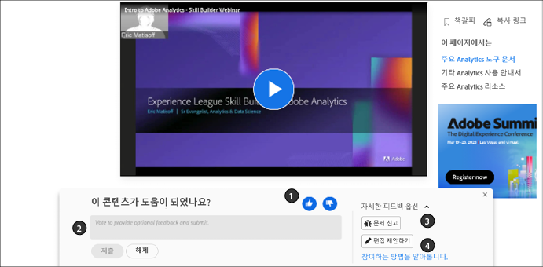
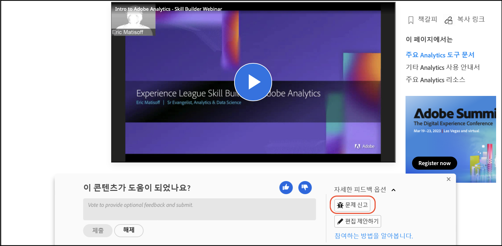

# Adobe 설명서에 대한 기여자 안내서

이 안내서는 Experience League에서 Adobe Enterprise 도움말에 기여할 수 있는 방법을 설명합니다.

## 협업 설명서란?

Adobe Experience Cloud 및 기타 Adobe Enterprise 제품에 대한 기술 문서와 지원 콘텐츠는 GitHub, Markdown 및 Adobe Experience Cloud 솔루션을 사용하는 오픈소스 원칙을 기반으로 합니다.

이 오픈소스 모델은 콘텐츠 품질을 향상시키고 고객, 설명서 팀 및 제품 팀 간의 커뮤니케이션을 향상시켜줍니다. 모든 페이지에서 콘텐츠 유용성을 평가하고, 문제를 기록하며, 콘텐츠 제안을 Git 가져오기 요청(PR)으로 제공할 수 있습니다. Adobe 설명서 팀은 매일 기여 및 문제를 모니터링하고 필요에 따라 업데이트, 수정 및 조정을 수행합니다.

## 협업 설명서 작업

직원, 파트너, 고객 또는 잠재 고객 등 이 자료의 사용자라면 몇 가지 간단한 방법으로 이 설명서에 기여할 수 있습니다.

* 페이지의 유용성을 평가하고 ❶ 선택적 주석을 ❷ 작성하십시오.
* 특정 페이지에 대한 문제 보고(Git 로그인 필요❸)
* 에셋 및 코드 샘플이 포함된 전체 문서를 작성하여 빠른 편집 제출(Git 로그인 필요❹)

이러한 옵션은 페이지가 열린 후 몇 초 후에 페이지 하단에 나타납니다. 피드백 영역을 무시하면 페이지를 다시 로드하여 다시 가져올 수 있습니다.

이 안내서는 이 자료 세트에 상호 작용하고 기여하기 위해 알아야 할 모든 사항을 개략적으로 설명합니다.

<!--
>[!IMPORTANT]
>All repositories that publish to docs.adobe.com have adopted the [Adobe Open Source Code of Conduct](../code-of-conduct.md) or the [.NET Foundation Code of Conduct](https://dotnetfoundation.org/code-of-conduct). For more information, see the [Contributing](../contributing.md) article.
>
> Minor corrections or clarifications to documentation and code examples in public repositories are covered by the [Adobe Documentation Terms of Use](https://www.adobe.com/legal/terms.html). New or significant changes generate a comment in the pull request, asking you to submit an online Contribution License Agreement (CLA) if you are not an employee of Adobe. We need you to complete the online form before we can review or accept your pull request.
-->

## 페이지의 유용성 평가 및 댓글 작성

페이지를 열고 몇 초 후에 페이지 하단에 피드백 영역이 나타납니다. 페이지가 유용했는지 여부를 표시하려면 위쪽 또는 아래쪽을 클릭합니다.

추가 피드백을 제공하려면 언제든지 댓글을 남겨 주십시오.

## 기존 문서의 빠른 편집

보다 자세한 피드백을 제공하려면 빠르게 편집하는 것이 문서의 사소한 오류와 누락을 수정하는 좋은 방법입니다. 편집을 제안할 때, 귀하는 당사에 수정/제안을 제출하기 위한 가져오기 요청(PR)을 제출하며, 당사는 제안을 검토, 승인 및 게시할 수 있습니다.

1. 수락하려면 [기여자 라이선스 계약(CLA)](http://opensource.adobe.com/cla.html)에 서명하십시오.

   Adobe CLA는 한 번만 제출하면 됩니다.

1. 문서 하단에 나타나는 피드백 영역에서 을 클릭합니다. **[!UICONTROL Detailed feedback options]**&#x200B;을 클릭한 다음 을 클릭합니다 **[!UICONTROL Suggest an edit]** GitHub의 Markdown 소스 파일로 이동합니다.

   

1. 연필 아이콘을 클릭하여 문서를 편집합니다.

   >[!NOTE]
   >
   >연필 아이콘이 회색으로 표시된다면 GitHub 계정에 로그인하거나 새 계정을 만들어야 합니다.

   

1. 웹 편집기에서 변경 작업을 수행합니다.

   **[!UICONTROL Preview changes]** 탭을 클릭하여 변경 내용의 서식을 확인할 수 있습니다.

1. 변경 작업을 수행한 후 페이지 하단으로 스크롤합니다.

   다음 그림과 같이 PR의 제목과 설명을 입력한 다음 **[!UICONTROL Propose file change]**&#x200B;을 클릭합니다.

   

   >[!NOTE]
   >
   >기여자 라이선스 계약(CLA) 서명과 관련한 인증 오류 메시지가 표시되는 경우 **[!UICONTROL Details]**&#x200B;를 클릭하여 사용권 계약을 엽니다. 수락하려면 계약서에 서명합니다. 그런 다음 가져오기 요청을 닫았다가 열고 계속합니다.

이제 모두 완료되었습니다. 설명서 팀원이 가져오기 요청을 검토하고 병합하게 됩니다. 감사합니다.

## 문제 보고

한 내용에 있는 문제에 대해 Adobe에 알리는 또 다른 간단한 방법은 **[!UICONTROL Report an issue]**&#x200B;을 사용하는 것입니다.

1. 문서 하단에 나타나는 피드백 영역에서 을 클릭합니다. **[!UICONTROL Detailed feedback options]**&#x200B;을 클릭한 다음 을 클릭합니다 **[!UICONTROL Report an issue]** GitHub의 Markdown 소스 파일로 이동합니다.

   

   >[!NOTE]
   >
   >문제를 보고하려면 GitHub 계정에 로그인하거나 계정을 만들어야 합니다.

   이 링크를 클릭하면 GitHub 문제 인터페이스를 사용하여 Experience League에 빠른 티켓을 기록할 수 있습니다.

   문제가 있는 페이지의 URL이 설명 필드에 자동으로 채워집니다.

1. 제목을 입력하고 문제에 대한 간단한 설명을 작성한 다음 *새 문제 제출*&#x200B;을 클릭합니다.

   

문제를 제출하면 이 페이지의 문제를 해결할 수 있는 콘텐츠 팀에게 알림이 전송됩니다. Adobe는 내용을 업데이트하면 Github 문제 인터페이스로 사용자에게 알리게 되며, 업데이트 또는 종료되면 이 인터페이스에서 이메일로 사용자에게 알려 줍니다.

## GitHub 권한 이해

GitHub 편집 UI는 저장소 권한에 맞게 조정됩니다. 대상 저장소에 대한 쓰기 권한이 없는 기여자의 경우 이전 이미지가 정확합니다. GitHub는 해당 계정의 대상 저장소의 포크를 자동으로 만듭니다. 대상 저장소에 대한 쓰기 권한이 있는 경우 GitHub는 대상 저장소에 새 분기를 만듭니다.

Adobe는 쓰기 권한이 있는 기여자의 경우에도 모든 변경 내용에 대해 가져오기 요청을 사용합니다. 대부분의 저장소에는 보호되는 `main` 분기가 있으므로 업데이트는 가져오기 요청으로 제출되어야 합니다.

브라우저 내 편집 환경은 변경 내용이 적거나 자주 변경하지 않는 경우 적합합니다. 크게 기여하거나 고급 Git 기능을 사용하는 경우 [저장소를 포크하고 로컬에서 작업](setup/full-workflow.md)해야 합니다.

## 피드백 제공

Adobe의 솔루션만큼 큰 솔루션 세트를 사용할 때 설명서는 항상 진행 중인 작업입니다. 오류를 발견하면 문제를 기록하고, 자료에 대한 제안이 있으면 알려 주십시오. 찾고 있었던 정보를 알려 주십시오. 필요한 내용을 찾을 수 없으면 알려 주십시오. 작업을 완료하는 데 어려움이 있다면 해결책 학습을 도와드릴 방법을 알려 주십시오.

Experience League의 협업 설명서 팀과 모든 작가, 콘텐츠 제작자로부터의 감사 인사를 전해 드립니다.
