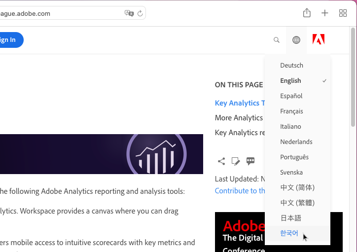
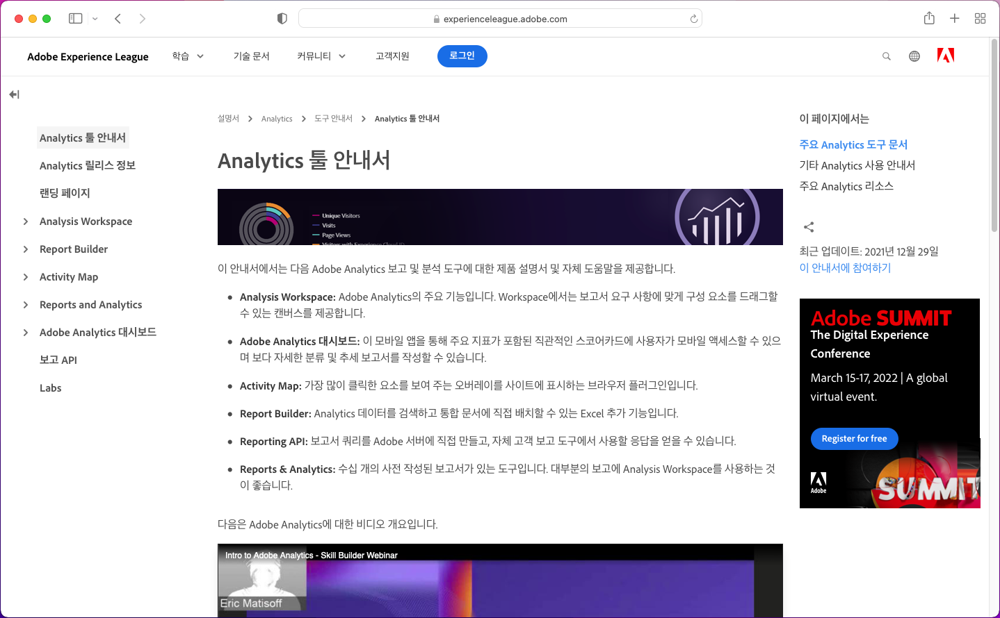
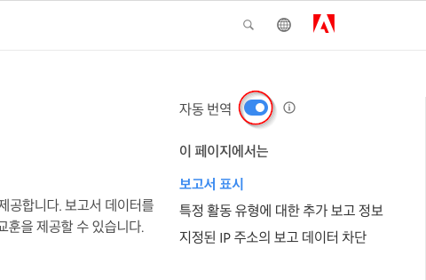
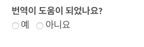
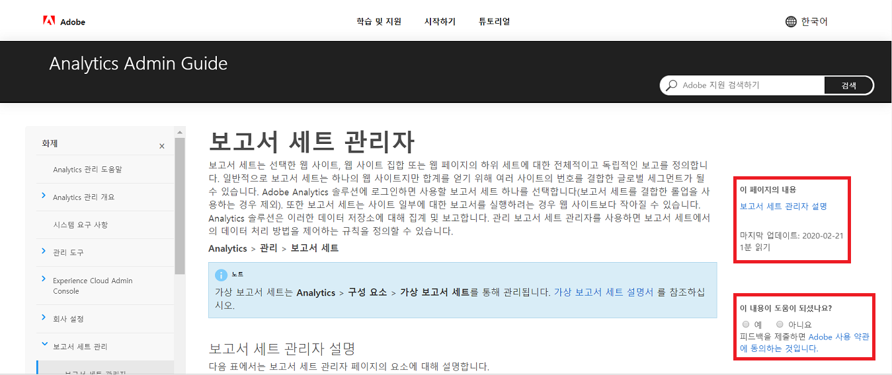

# Adobe Experience Cloud 제품 설명서에 대한 언어 지원

Adobe에서는 사용자가 설명서, 도움말 및 지원 콘텐츠를 Adobe 제품에서 지원되는 언어로 쉽게 이용할 수 있게 되기를 기대하는 것으로 알고 있습니다. 이 목표를 달성하기 위해 Adobe에서는 사용자가 원하는 언어를 선택할 수 있고 번역된 콘텐츠의 품질에 대한 피드백을 제공할 수 있는 고유한 번역 경험을 제공합니다.

## 언어 선택

대부분 언어로 Adobe Experience Cloud 제품 설명서를 볼 수 있습니다.

1. Experience Cloud [제품 설명서](https://helpx.adobe.com/kr/support/experience-cloud.html)로 이동합니다.

1. 도움말 페이지(예: [Analytics](https://docs.adobe.com/content/help/ko-KR/analytics/landing/home.html))를 찾습니다.

1. 언어 선택기(지구 모양 아이콘)를 클릭하여 언어를 선택합니다.

   

   선택한 언어로 페이지가 표시됩니다.

   

   원하는 언어 버전을 아직 이용할 수 없는 경우에는 원하는 콘텐츠를 Adobe에서 자동으로 번역할 수 있습니다. Adobe의 자동 번역 서비스를 통해 페이지 맨 위의 파란색 필드에 메시지가 표시됩니다.

   

   콘텐츠가 원하는 언어로 자동으로 제공되거나 사용자가 링크를 클릭하여 번역을 작동할 수 있습니다. (이 시나리오는 번역된 페이지에서 영어 소스로 돌아가려고 하이퍼링크를 클릭하면 발생할 수 있습니다. 필요할 때 번역된 페이지를 볼 수 있는 옵션이 제공됩니다.) 언제든지 영문 소스로 돌아갈 수 있습니다.

   가끔 영문 소스가 최근에 업데이트되어 번역이 완료되기 전에 게시되는 경우가 있습니다. 드롭다운 메뉴에서 원하는 언어를 클릭하면 페이지가 이전 버전에서 번역되었으며 업데이트된 콘텐츠가 곧 제공될 예정이라는 알림이 페이지 맨 위의 담청색 가로 막대에 표시됩니다. 필요하면 새 브라우저 창에서 최신 영문 소스 콘텐츠를 선택하여 볼 수 있습니다.

## 자동 번역을 사용하는 이유

Adobe에서는 자동 번역 기능을 이용하여 콘텐츠 생성과 최대한 가까운 시점에 다양한 언어로 제품 지원 콘텐츠를 게시합니다. 제품을 사용하려면 지원 콘텐츠가 매우 중요하므로 숙련된 전문가의 콘텐츠 번역을 우선시하지만, 속도가 가장 중요하고 긴급하면 자동 번역을 선택할 수도 있습니다.

자동 번역은 인터넷의 어디에나 존재하며 강력한 정보 수집 도구로 사용하는 것이 일반적으로 용인되고 있습니다. 사람의 개입이 거의 필요 없을 수도 있는 기술 자료 콘텐츠에 널리 이용되고 있습니다. 최근 몇 년 사이에 기술이 획기적으로 발전했지만, 자동으로 생성한 번역에는 가끔 언어와 의미의 부정확성과 오류가 포함될 수 있습니다.

### 브라우저를 통한 자동 번역

원하는 언어로 자동으로 페이지를 번역하도록 브라우저 환경 설정을 설정하면 번역 결과가 Adobe 페이지를 통해 얻은 결과와 다를 수 있습니다. 이유는 브라우저에서 제공되는 서비스는 상투적인 번역일 수 있는 반면, Adobe 스타일 지침과 용어를 준수하도록 사용자 지정되기 때문입니다. 최적 자동 번역 결과를 얻으려면 브라우저 환경 설정에서 이 특정 사이트에 대한 브라우저 옵션을 비활성화하거나 옵션이 표시될 때 **번역하지 않음**&#x200B;을 클릭하는 것이 좋습니다.

### 알려진 문제

불완전한 번역, 손상된 문자 또는 페이지 레이아웃과 같은 문제가 자동 번역 출력에서 가끔 발생할 수도 있습니다. Adobe에서 사용하는 작성, 게시 또는 번역 기술 도구가 다양하기 때문에 이러한 문제가 발생합니다. 이 세상의 온갖 노력을 다하여 알려진 문제 목록을 작성하겠습니다.

| **ISSUE ID** | **설명** | **상태** |
|--------------|-------------------------------------------------------------------------------------|------------|
| G11N3558 | 일부 Audience Manager 페이지는 절반은 영어로 번역되며 절반은 프랑스어로 번역됩니다(프랑스어, 스페인어). | 미해결 |

### 피드백

기본적으로 또는 사용자 조치를 통해 콘텐츠가 자동으로 번역될 때마다 번역에 대한 피드백을 Adobe에 제공하는 옵션이 있습니다. 페이지 맨 위의 담청색 가로 막대에서 “이 번역이 유용했습니까?”라는 질문에 “예” 또는 “아니요”로 답변할 수 있습니다. Adobe에서는 콘텐츠 번역에 대한 의사를 결정하기 위해 이 귀중한 지표를 수집하여 축적된 데이터를 분석합니다. Adobe에서는 피드백을 존중하며 응답을 장려합니다.

앞으로 문제를 기록하고 개선 사항을 제안하고 추가 언어를 요청하는 형태로 더욱 광범위한 피드백을 제공할 수 있도록 할 계획입니다. 이러한 기능 중 일부는 이미 영문 페이지에서 제공되고 있습니다. 장기적으로 Adobe에서 이러한 페이지의 사용자 경험을 개선하는 데 도움이 될 것으로 생각합니다.

